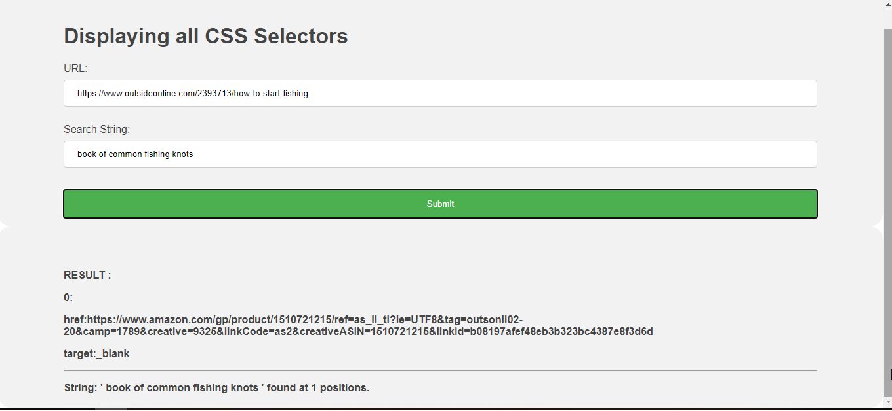
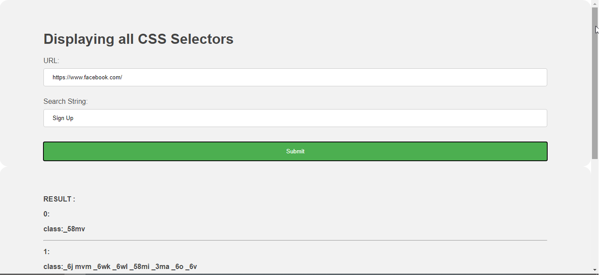
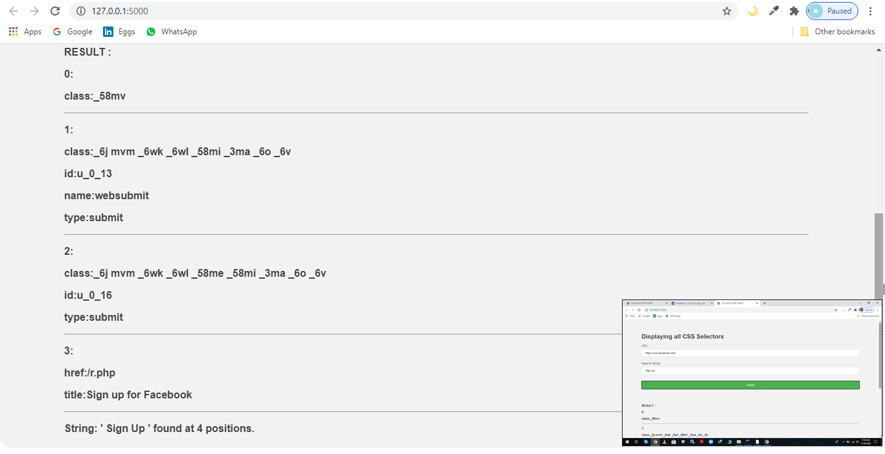

# Form (Outputs the CSS Selector corresponding to the search term using Selenium,Python,Flask)

Q4) Using python and selenium  
You can use any program skill to make a form (it depends on you)  
1. Create a form for entering URLs and search terms 
2. If you enter a URL and a search word and operate it, you can access the URL  
Outputs the CSS Selector of all html elements corresponding to the search term (innertext).  
* You can also use JavaScript.

### Example no. 1

### Example no. 2

